# **SoundMath: Accessible Geometry Learning**

**SoundMath** is a **web application** that empowers **visually impaired students** to explore and understand **geometric shapes** using **real-time object detection** and **audio feedback**.  
By combining **deep learning (YOLOv8)**, **speech synthesis**, and **keyboard accessibility**, SoundMath transforms traditional geometry into a **multisensory learning experience**.

---

## Table of Contents

1. [Introduction](#introduction)  
2. [Features](#features)  
3. [Technologies Used](#technologies-used)  
4. [Prerequisites](#prerequisites)  
5. [Installation](#installation)  
6. [Model Training (YOLOv8)](#model-training-yolov8)  
7. [Usage](#usage)  
8. [App Screenshots](#app-screenshots)  
9. [Contributors](#contributors)  
10. [License](#license)

---

## Introduction

**SoundMath** bridges the accessibility gap in geometry education by converting visual recognition into **auditory experiences**.  
Through **real-time camera input**, **YOLOv8-based detection**, and **text-to-speech feedback**, learners can *hear* descriptions of geometric shapes, helping them develop spatial awareness and geometric understanding without relying on sight.

---

## Features

- 🎥 **Real-Time Shape Detection**  
  Detects geometric shapes live via webcam and display detected shapes with its description.

- ⌨️ **Keyboard Navigation**  
  Fully accessible interface controlled through keyboard shortcuts.

- 🔊 **Audio Shape Descriptions**  
  Provides tactile and descriptive audio feedback for each detected shape.

- 👤 **Profile Management**  
  Users can manage their profiles securely — view, update, or delete accounts.

- 🔐 **Secure Firebase Authentication**  
  Uses Firebase Authentication for safe and reliable login management.

---

## Technologies Used

### **Backend**
- Flask (Python)
- Firebase Admin SDK
- OpenCV
- NumPy
- Flask-CORS
- YOLOv8 (Ultralytics)

### **Frontend**
- React + Vite
- Web Speech API
- Axios
- Firebase Authentication
- Toastify (notifications)

### **Database**
- Firestore Database

### **Model Training**
- Google Colab
- Roboflow
- Ultralytics YOLOv8

---

## Prerequisites

Ensure you have:

### **Backend**
- Python ≥ 3.8  
- pip (Package manager)

### **Frontend**
- Node.js ≥ 16.x  
- npm (Node Package Manager)

---

## Installation

### **Backend Setup**

1. **Extract the project folder**

2. **Create & activate virtual environment**
   ```bash
   python -m venv venv
   source venv/bin/activate   # macOS/Linux
   venv\Scripts\activate      # Windows
   ```

3. **Install dependencies**
   ```bash
   pip install -r requirements.txt
   ```

4. **Run Flask server**
   ```bash
   python app.py
   ```
   → Backend runs at `http://127.0.0.1:5000/`

---

### **Frontend Setup**

1. **Navigate to the frontend**
   ```bash
   cd frontend
   ```

2. **Install dependencies**
   ```bash
   npm install
   ```

3. **Configure Firebase** (see below)

4. **Start development server**
   ```bash
   npm run dev
   ```
   → Frontend runs at `http://localhost:5173/`

---

### Firebase Configuration

1. In your [Firebase Console](https://console.firebase.google.com/), create a new project.  
2. Enable **Authentication → Email/Password**.  
3. Go to Project Settings → “Your Apps” → Copy your SDK config.  
4. Copy project configuration data and paste in `frontend/src/firebaseConfig.js`:
   
   ```bash
   const firebaseConfig = {
     apiKey: "YOUR_API_KEY",
     authDomain: "YOUR_AUTH_DOMAIN",
     projectId: "YOUR_PROJECT_ID",
     storageBucket: "YOUR_STORAGE_BUCKET",
     messagingSenderId: "YOUR_SENDER_ID",
     appId: "YOUR_APP_ID",
   };
   ```
---

## Model Training (YOLOv8)

Model training was performed in **Google Colab** using  
`ShapesDetectionModel_YOLOv8_training.ipynb`.

### **Training Overview**
- Shapes were annotated and labeled using **Roboflow**.  
- Unified 7 shape classes:  
  `circle, parallelogram, rectangle, rhombus, square, triangle, trapezoid`
- Trained **YOLOv8m** for 20 epochs at 640×640 resolution.  
- Visualized metrics (Precision, Recall, F1, PR curves, confusion matrix).  
- Final model saved as:  
  `yolov8_shapes_detection_model_v1.pt`

---

## Usage

1. Start both **backend** and **frontend** servers.  
2. Open `http://localhost:5173/` in your browser.  
3. Log in or register via Firebase Authentication.  
4. Navigate to **Start Detection**.  
5. Control the app using **UI Buttons** or **keyboard shortcuts**:

| Shortcut   | Action                       |
|------------|------------------------------|
| `Ctrl + B` | Start Detection              |
| `Ctrl + X` | Stop Detection               |
| `Ctrl + M` | Go to Home                   |
| `Ctrl + L` | Open Profile                 |
| `Esc`      | Close Description Modal      |
| `Ctrl + Y` | Repeat Shortcut Instructions |

6. When a shape is detected consistently a **description modal** appears and reads the tactile description aloud.

---

## App Screenshots

### Home
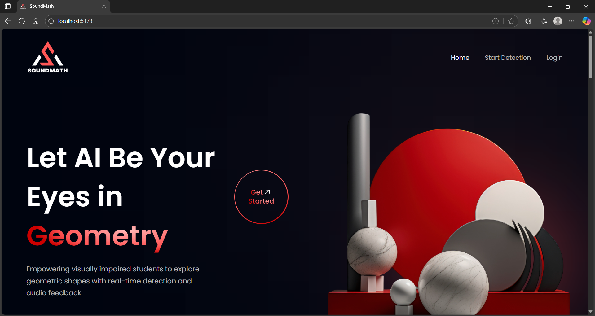
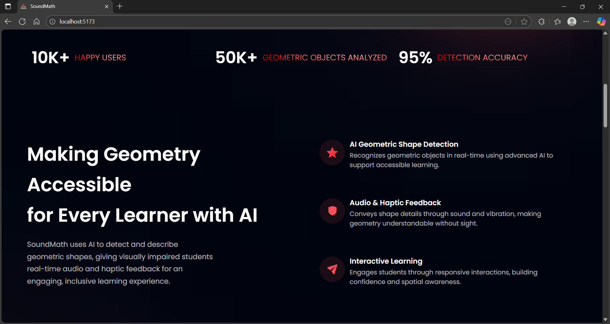
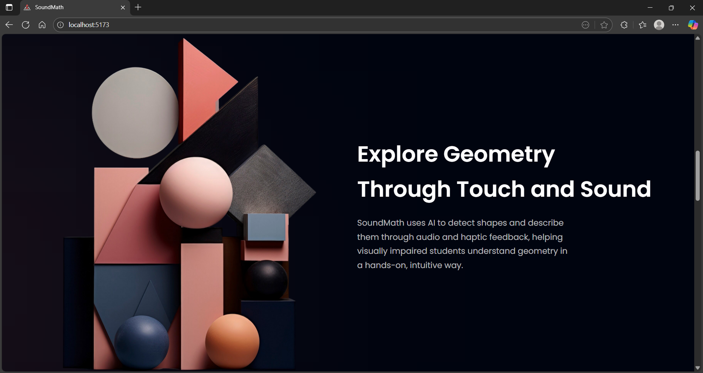
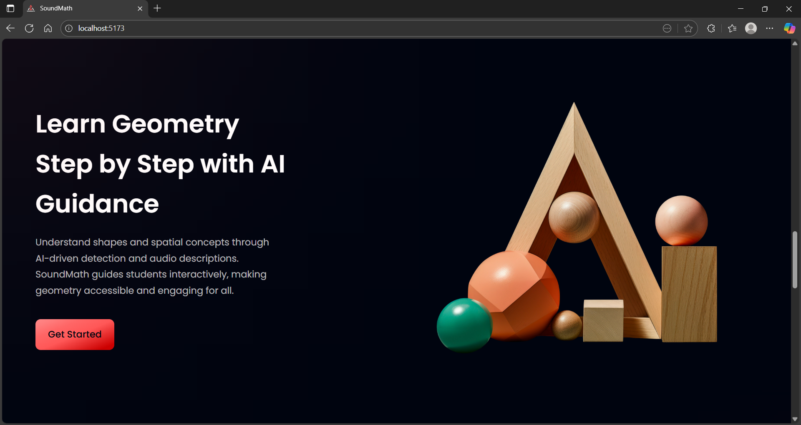
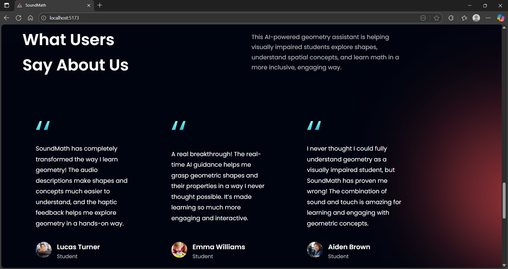
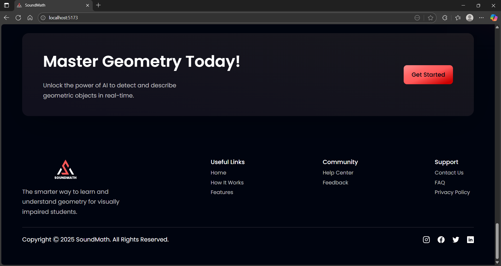

### Login
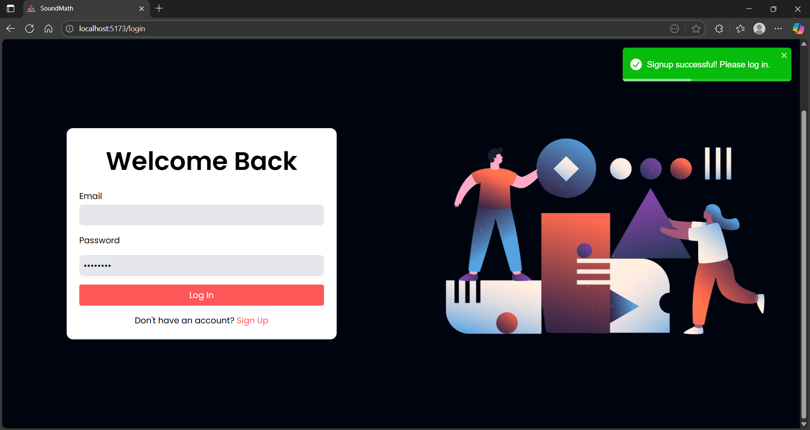

### Signup
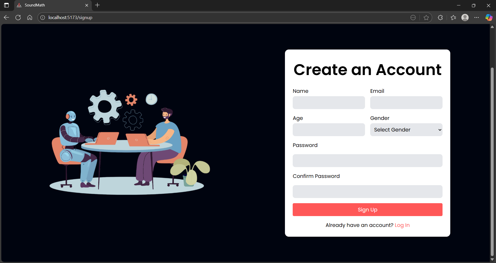

### Real-Time Detection  
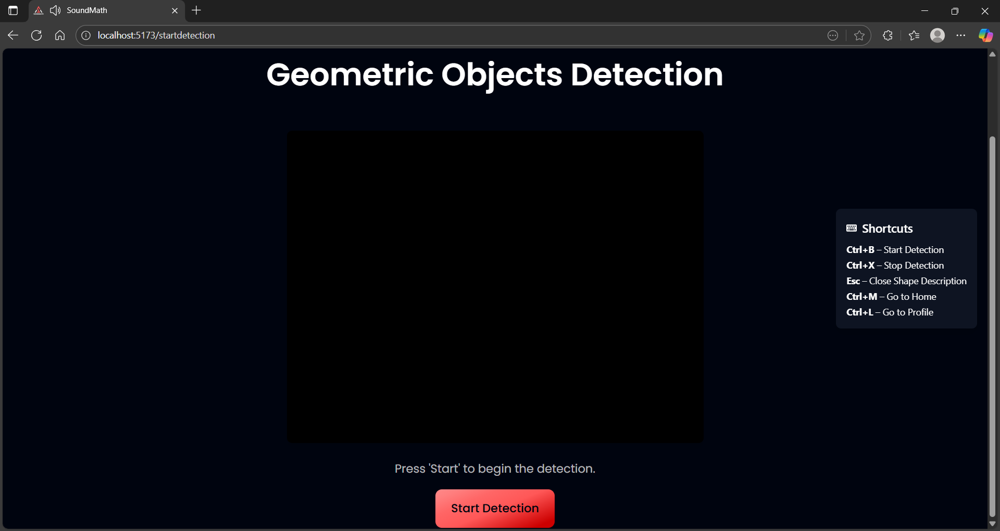  
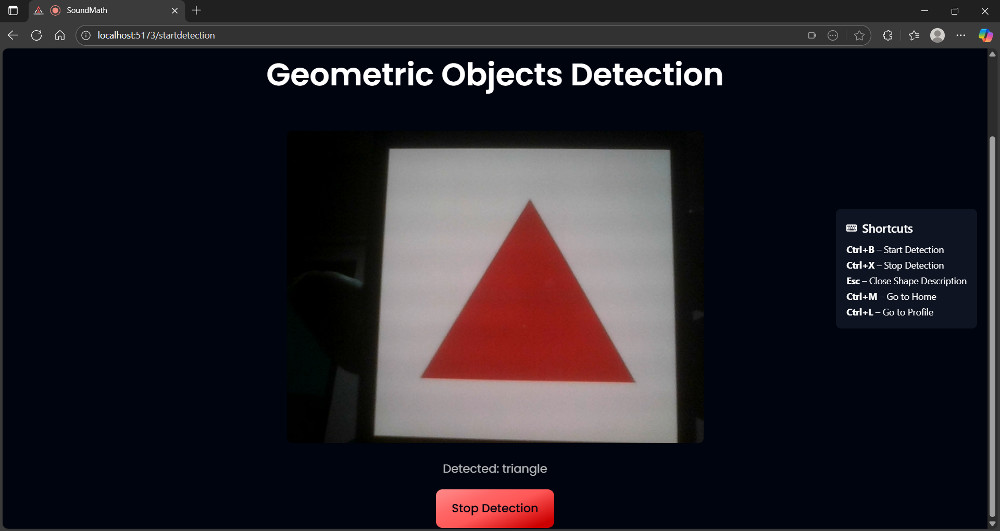

### Shape Description  
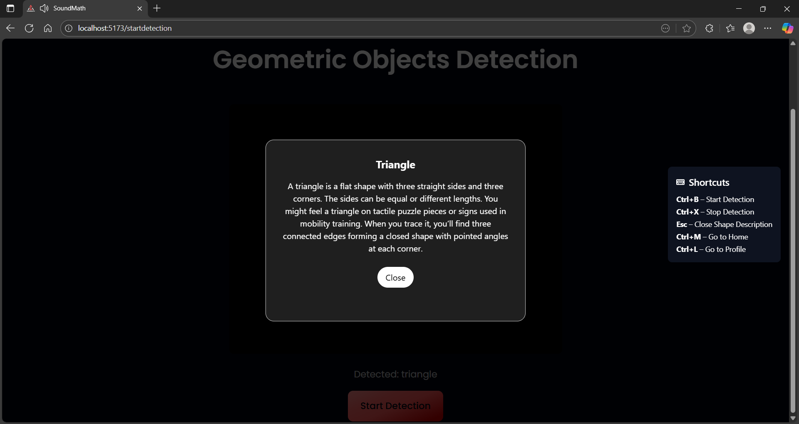  

### Profile  
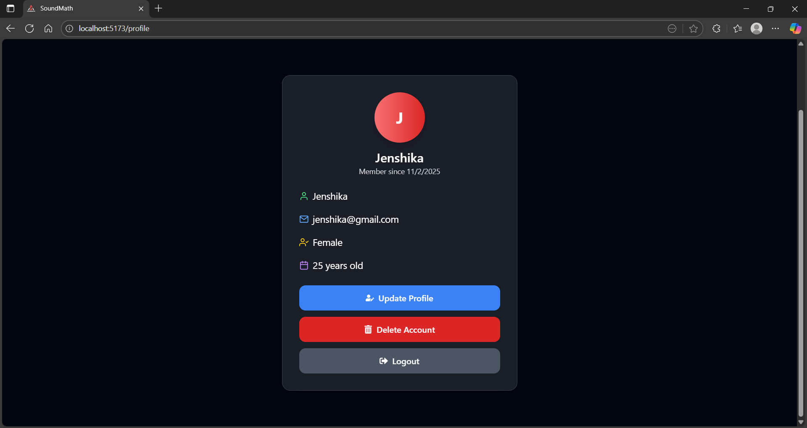  
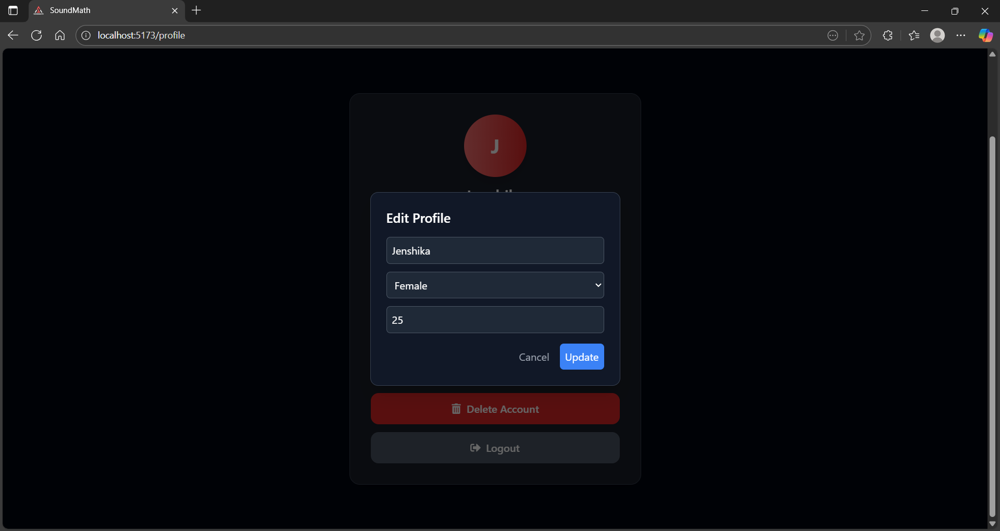  

---

## Contributors

| Name                  | Role      | Contribution                                                                                                      |
|-----------------------|-----------|-------------------------------------------------------------------------------------------------------------------|
| **[Jenshika Jeisin]** | Developer | UI design, dataset annotation, Model training, backend development, frontend development, Firebase setup, Testing |

---

## License

Licensed under the **MIT License**.  
See [LICENSE](LICENSE) for more information.

---

### Acknowledgments

Special thanks to:
- **Ultralytics** – YOLOv8 Object Detection  
- **Roboflow** – Dataset Annotation and Labeling  
- **Google Colab** – Model Training  
- **Firebase** – Authentication & Database  
- **The visually impaired community** – Inspiration and purpose  

⭐ If you like this project, please give it a star on GitHub!
